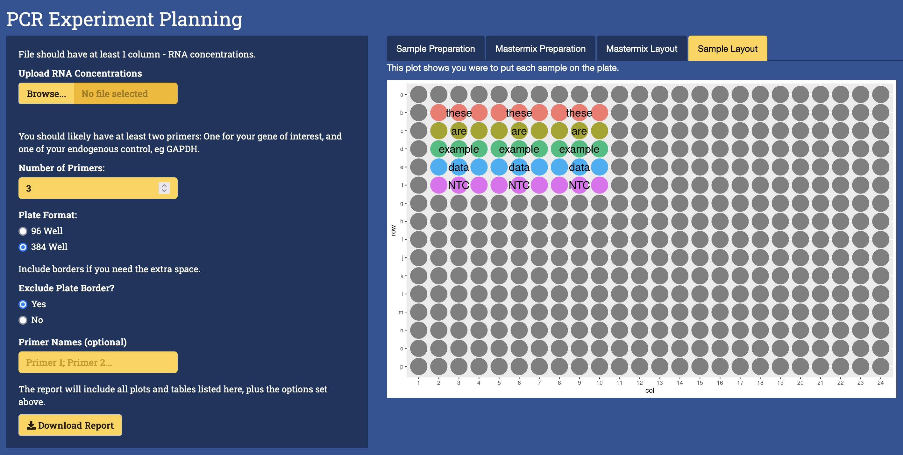

# Overview

plan-pcr is a shiny app meant to help those performing comparative (ddCt) qPCR with [this protocol](https://bookdown.org/adamaragaki/public_knowledge/deltadelta-qrt-pcr.html) (or similar).

Below is a screenshot:

It has features that can help you:

- Calculate the amount of mastermix needed
- Dilute your samples
- Lay out your samples/primers
- Create a report for your records